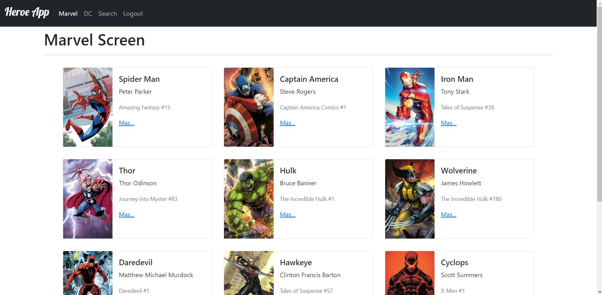

# Heroe App
Single Page Application and Rest-API from Marvel and DC heroes

## Preview

### Give it a try!
**<https://hectorsum.github.io/heroe-app/>**

### Technologies used

### To start this project:
- npm install
- npm run start
